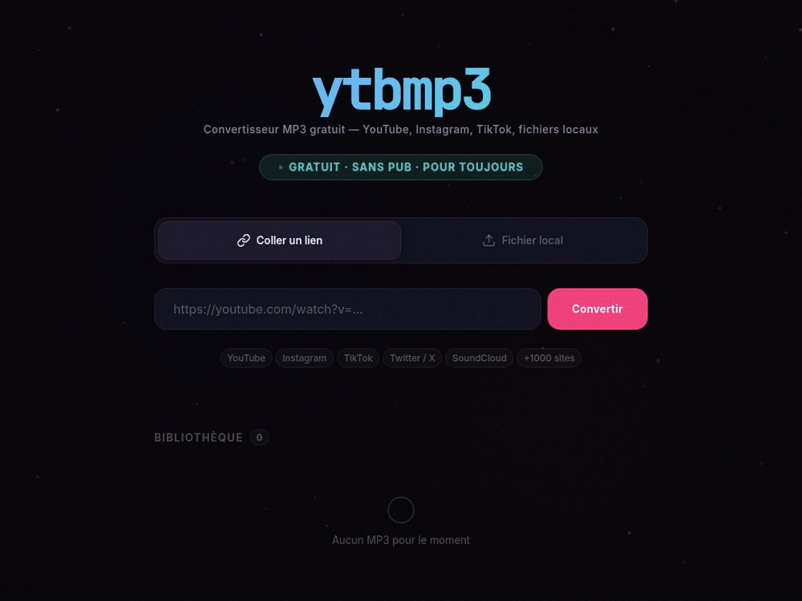

# durump3



Paste a link or drop a file, get an MP3. A small self-hosted Flask app on top of yt-dlp and ffmpeg: no ads,
no account, nothing leaves your machine except the download itself. The UI ships under the name *ytbmp3*.

- **Links**: YouTube, Instagram, TikTok, X, SoundCloud and the rest of what yt-dlp supports. Best audio
  quality, tags and cover art embedded.
- **Local files**: mp4, webm, mkv, wav, flac… through ffmpeg, up to 500 MB.
- Conversions run in background threads and the page polls them. Finished files stay in a library.
- One landing page per platform, plus a generated sitemap and robots.txt.
- `ytbmp3.sh` does the same from a terminal.

## Run it

```bash
python3 -m venv venv && . venv/bin/activate
pip install -r requirements.txt          # also needs ffmpeg: apt install ffmpeg / brew install ffmpeg
YT_DLP=$(which yt-dlp) python app.py     # http://localhost:5000
```

`python app.py` is Flask's dev server with debug on, listening on all interfaces. That's fine on your own
machine; put a real WSGI server in front of it before exposing it anywhere.

From the terminal:

```bash
./ytbmp3.sh URL [URL ...]      # MP3s land in ./mp3 (or $OUT_DIR)
./ytbmp3.sh -f links.txt       # one URL per line, # for comments
```

Only convert what you have the right to.

## License

MIT © Scarville
